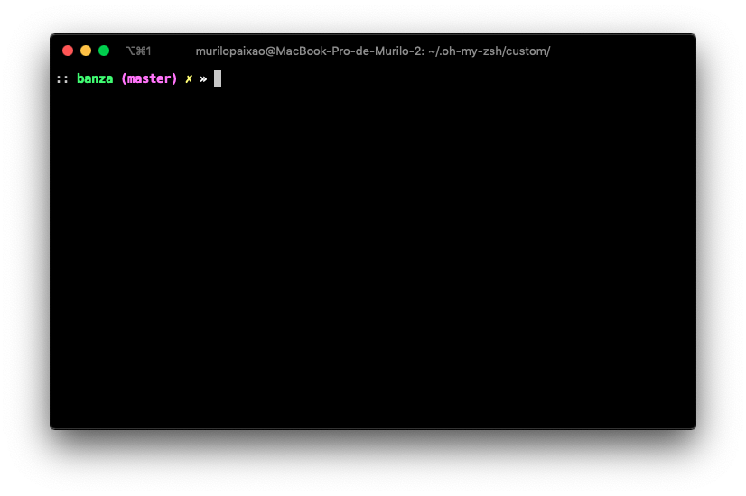

# Banza

Skinny and ~almost~ topless like evan's prompt, but higher.



## Installation

Clone this repo: 
```sh
git clone https://github.com/pogist/banza "$ZSH_CUSTOM/themes"
```

Symlink `banza.zsh-theme` with .oh-my-zsh custom folder:
```sh
ln -s "$ZSH_CUSTOM/themes/banza/banza.zsh-theme" "$ZSH_CUSTOM/themes/banza.zsh-theme"
```

Set `ZSH_THEME="banza"` in your `.zshrc`.
